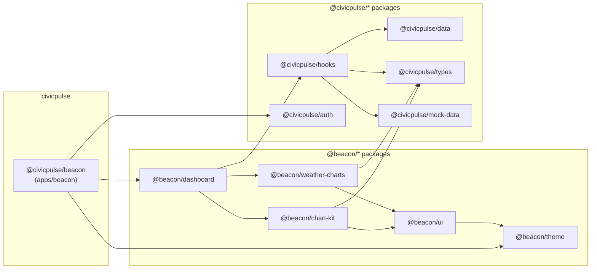

# 05.5 — Nexus BETA Merge (Step 0)

## Goal

This repo *becomes* the **CivicPulse Nexus BETA monorepo**. We merge the `rie-nexus-kickstarter` config and scaffold structure *into* this repo, then move the beacon app code into its correct 4-tier slot.

The `rie-nexus-kickstarter` is the **config donor**. Its `nx.json`, `pnpm-workspace.yaml`, `eslint.config.mjs`, `tsconfig.base.json`, `turbo.json`, and `REPOS_ATLAS.md` all get merged in here. The Nexus's existing scaffolds (`repos/scaffolds/...`) come along for the ride as reference dev templates.

The beacon app moves from the root into `repos/civicpulse/apps/beacon`. All supporting component libs/packages go into `repos/civicpulse/packages/`.

> [!IMPORTANT]
> After this migration, `npm run dev` at the root should still boot the beacon app. The root scripts proxy into `nx run beacon:dev`.

> [!NOTE]
> `turbo.json` is **retained** at root as a stub for v0 backward compatibility (v0.dev platform expects it for build detection). Nx is the actual task orchestrator.

---

## 4-Tier Workspace Hierarchy (Target)

The `rie-nexus-kickstarter` established this canonical structure. We adopt it exactly:

```
Tier 1 (Root)       → Config & orchestration only
Tier 2 (repos/)     → Logical domains (e.g., civicpulse, scaffolds)
Tier 3 (Type)       → apps/ or packages/
Tier 4 (Project)    → Individual application or library
```

**`pnpm-workspace.yaml` (merged from Nexus):**
```yaml
packages:
  - "repos/*/apps/*"
  - "repos/*/packages/*"
```

---

## Final Directory Layout (Post-Merge)

```
v0-beacon-dashboard-build/              ← renamed/rebranded later; this IS the Nexus BETA
│
├── nx.json                             ← from Nexus (NX v22.5, inferred plugins)
├── turbo.json                          ← RETAINED from Nexus (v0 compat stub)
├── pnpm-workspace.yaml                 ← from Nexus
├── tsconfig.base.json                  ← from Nexus (merged with beacon aliases)
├── eslint.config.mjs                   ← from Nexus (@nx/eslint-plugin flat config)
├── package.json                        ← root merged: Nexus devDeps + beacon libs
├── jest.config.ts / jest.preset.js     ← from Nexus
├── .prettierrc / .prettierignore       ← from Nexus
├── REPOS_ATLAS.md                      ← from Nexus, updated with civicpulse entries
│
├── repos/
│   ├── scaffolds/                      ← from Nexus (kept as reference templates)
│   │   ├── apps/
│   │   │   ├── nextjs-web/             ← NX Next.js app scaffold template
│   │   │   └── nextjs-web-e2e/         ← Playwright E2E template
│   │   └── packages/
│   │       └── ui/                     ← Base-UI component library template
│   │
│   └── civicpulse/                     ← NEW: the main product domain
│       ├── apps/
│       │   └── beacon/                 ← beacon app code lives here
│       │       ├── app/                  (Next.js routes — thin shell)
│       │       ├── public/
│       │       ├── next.config.ts
│       │       ├── tailwind.config.ts
│       │       ├── tsconfig.json
│       │       └── package.json          (name: "@civicpulse/beacon")
│       │
│       └── packages/                   ← shared libs consumed by beacon (and future apps)
│           │
│           ├── beacon-ui/              ← @beacon/ui — shadcn base component library
│           │   ├── src/components/
│           │   ├── src/styles/globals.css
│           │   ├── src/lib/utils.ts
│           │   ├── components.json
│           │   └── package.json        (name: "@beacon/ui", exports map)
│           │
│           ├── chart-kit/              ← @beacon/chart-kit — generic charts
│           │   ├── src/atoms/
│           │   ├── src/molecules/
│           │   ├── src/organisms/
│           │   └── package.json        (name: "@beacon/chart-kit")
│           │
│           ├── weather-charts/         ← @beacon/weather-charts — domain charts
│           │   ├── src/atoms/
│           │   ├── src/molecules/
│           │   ├── src/organisms/
│           │   └── package.json        (name: "@beacon/weather-charts")
│           │
│           ├── dashboard/              ← @beacon/dashboard — grid + presets
│           │   └── package.json        (name: "@beacon/dashboard")
│           │
│           ├── theme/                  ← @beacon/theme — OKLCH + ThemeProvider
│           │   └── package.json        (name: "@beacon/theme")
│           │
│           ├── data/                   ← @civicpulse/data — Effect.ts / Hono clients
│           │   └── package.json        (name: "@civicpulse/data")
│           │
│           ├── hooks/                  ← @civicpulse/hooks — data-layer React hooks
│           │   └── package.json        (name: "@civicpulse/hooks")
│           │
│           ├── auth/                   ← @civicpulse/auth — auth utilities
│           │   └── package.json        (name: "@civicpulse/auth")
│           │
│           ├── types/                  ← @civicpulse/types — shared TS interfaces
│           │   └── package.json        (name: "@civicpulse/types")
│           │
│           ├── utils/                  ← @civicpulse/utils — shared helpers
│           │   └── package.json        (name: "@civicpulse/utils")
│           │
│           └── mock-data/              ← @civicpulse/mock-data — PRNG seeded fixtures
│               └── package.json        (name: "@civicpulse/mock-data")
│
├── docs/                               ← stays at root (this plan lives here)
├── .agent/                             ← agent kit stays at root
└── .env* / mise.toml / .npmrc          ← from Nexus
```

---

## Package Namespace Strategy

| Scope | Meaning | Examples |
|-------|---------|---------|
| `@beacon/*` | UI components & design system | `chart-kit`, `weather-charts`, `ui`, `theme`, `dashboard` |
| `@civicpulse/*` | Data, logic, domain layer | `data`, `hooks`, `auth`, `types`, `utils`, `mock-data`, `beacon` (the app) |

The **beacon app itself** (`repos/civicpulse/apps/beacon`) is named `@civicpulse/beacon` — it *consumes* `@beacon/*` libs.

---

## Root `package.json` — Config Delta

The beacon root currently uses **npm**. The Nexus uses **pnpm**. We will adopt pnpm as part of this merge.

Key changes to root `package.json`:
```json
{
  "name": "civicpulse-nexus",
  "packageManager": "pnpm@9.x.x",
  "scripts": {
    "dev": "pnpm nx run @civicpulse/beacon:dev",
    "build": "pnpm nx run-many -t build",
    "lint": "pnpm nx run-many -t lint",
    "typecheck": "pnpm nx run-many -t typecheck"
  }
}
```

> [!WARNING]
> Switching from npm → pnpm requires deleting `package-lock.json` and running `pnpm install`. All devDeps from Nexus (`@nx/*`, `jest`, `playwright`, `SWC`, etc.) will be hoisted to root.

---

## `tsconfig.base.json` — Paths Merge

Nexus `tsconfig.base.json` provides the strict TS base. We merge in path aliases for all packages:
```jsonc
{
  "compilerOptions": {
    // ...from Nexus (strict, composite, declarationMap)
    "paths": {
      "@beacon/ui": ["repos/civicpulse/packages/beacon-ui/src/index.ts"],
      "@beacon/chart-kit": ["repos/civicpulse/packages/chart-kit/src/index.ts"],
      "@beacon/weather-charts": ["repos/civicpulse/packages/weather-charts/src/index.ts"],
      "@beacon/dashboard": ["repos/civicpulse/packages/dashboard/src/index.ts"],
      "@beacon/theme": ["repos/civicpulse/packages/theme/src/index.ts"],
      "@civicpulse/data": ["repos/civicpulse/packages/data/src/index.ts"],
      "@civicpulse/hooks": ["repos/civicpulse/packages/hooks/src/index.ts"],
      "@civicpulse/auth": ["repos/civicpulse/packages/auth/src/index.ts"],
      "@civicpulse/types": ["repos/civicpulse/packages/types/src/index.ts"],
      "@civicpulse/utils": ["repos/civicpulse/packages/utils/src/index.ts"],
      "@civicpulse/mock-data": ["repos/civicpulse/packages/mock-data/src/index.ts"]
    }
  }
}
```

---

## `REPOS_ATLAS.md` — Merge Update

After merging, add the `civicpulse` entries into the Nexus REPOS_ATLAS:

| Directory | Responsibility |
|-----------|---------------|
| `repos/scaffolds/...` | (from Nexus) Reference templates |
| `repos/civicpulse/apps/beacon/` | CivicPulse Beacon Dashboard — main Product App |
| `repos/civicpulse/packages/beacon-ui/` | `@beacon/ui` — shadcn primitives |
| `repos/civicpulse/packages/chart-kit/` | `@beacon/chart-kit` — generic charting library |
| `repos/civicpulse/packages/weather-charts/` | `@beacon/weather-charts` — domain weather visualizations |
| `repos/civicpulse/packages/dashboard/` | `@beacon/dashboard` — drag-and-drop grid engine |
| `repos/civicpulse/packages/theme/` | `@beacon/theme` — OKLCH theme engine & provider |
| `repos/civicpulse/packages/data/` | `@civicpulse/data` — Effect.ts / Hono data clients |
| `repos/civicpulse/packages/hooks/` | `@civicpulse/hooks` — React data hooks |
| `repos/civicpulse/packages/auth/` | `@civicpulse/auth` — auth utilities |
| `repos/civicpulse/packages/types/` | `@civicpulse/types` — domain-wide type interfaces |

---

## Migration Phases

### Phase 1 — Merge Nexus Config Into Root (Est: 1 hour)
- Copy in from `rie-nexus-kickstarter`: `nx.json`, `pnpm-workspace.yaml`, `eslint.config.mjs`, `tsconfig.base.json`, `turbo.json`, `jest.config.ts`, `jest.preset.js`, `.prettierrc`, `.prettierignore`, `.npmrc`, `mise.toml`
- Merge `package.json` root: adopt pnpm, add Nexus devDeps alongside beacon's deps
- Copy the entire `repos/scaffolds/` directory from Nexus (free reference templates)

### Phase 2 — Restructure Beacon Into `repos/civicpulse/apps/beacon` (Est: 1–2 hours)
- `mkdir -p repos/civicpulse/apps/beacon`
- Move all current root source dirs: `app/`, `public/`, `components/` (will be extracted into packages), `next.config.ts`, `postcss.config.*`, `tailwind.config.ts`
- Update `apps/beacon/package.json` → name `"@civicpulse/beacon"`
- Verify the app still loads via `pnpm nx run @civicpulse/beacon:dev`

### Phase 3 — Extract Packages Into `repos/civicpulse/packages/` (Est: 3–5 hours)
- Scaffold each package with its `package.json` / `tsconfig.json` (can leverage the `ui` scaffold template for UI packages)
- Move source files out of `components/` and `lib/` into their respective packages
- Update all imports across `apps/beacon` to use `@beacon/*` / `@civicpulse/*` aliases
- Run `pnpm nx run-many -t typecheck` to verify

### Phase 4 — Update REPOS_ATLAS + Worktree Setup (Est: 30 min)
- Update `REPOS_ATLAS.md` with all civicpulse entries
- Setup per-lib worktrees: `wt/beacon-chart-kit`, `wt/civicpulse-data`, etc.
- Verify `nx graph` shows the correct dependency tree with no circular deps

**Total estimate: 6–9 hours**

---

## Dependency Graph



---

## Worktree Strategy (Post-Phase 4)

Each package gets its own worktree branch for parallel development:

| Worktree | Branch | Package |
|----------|---------|---------|
| `wt/beacon-ui` | `feat/beacon-ui` | `@beacon/ui` |
| `wt/chart-kit` | `feat/chart-kit` | `@beacon/chart-kit` |
| `wt/weather-charts` | `feat/weather-charts` | `@beacon/weather-charts` |
| `wt/civicpulse-data` | `feat/civicpulse-data` | `@civicpulse/data` |
| `wt/beacon-app` | `feat/beacon-app` | `@civicpulse/beacon` (you, hands-on) |

Agent operates in package-scoped worktrees. You own `wt/beacon-app` and `wt/civicpulse-data`.

---

## Dev Tooling: `mise` Binary Conventions

All binary tooling in this workspace is **version-pinned via `mise`**. Since the user's default shell is **fish** (which may not source mise shims in all agent execution contexts), all agents MUST use the `mise exec -- <command>` pattern when invoking any managed binary. **Never call binaries directly** (e.g. `pnpm ...`) — always prefix with `mise exec --`.

> [!IMPORTANT]
> **ALL AGENTS MUST FOLLOW THIS RULE:** Use `mise exec -- <tool> <args>` for every binary command. This ensures the pinned version from `mise.lock` is used regardless of the calling shell or environment context.

### Pinned Versions (from `mise.lock`)

| Tool | Pinned Version | Usage |
|------|--------------|-------|
| `node` | `24.14.0` (LTS Krypton) | JS runtime for all scripts |
| `pnpm` | `10.32.1` | Package manager (replaces npm) |
| `bun` | `1.3.10` | Fast runner for ad-hoc scripts |
| `dotenvx` | `1.55.1` | Encrypted `.env` management |
| `aws-cli` | `2.34.9` | AWS resource management & SST deploy |
| `aws-vault` | `7.9.10` | Secure AWS credential provider |
| `fish` | `4.5.0` | User's default shell (aqua-managed) |

### Required Command Patterns

```bash
# ✅ CORRECT — always use `mise exec --`
mise exec -- pnpm install
mise exec -- pnpm nx run @civicpulse/beacon:dev
mise exec -- pnpm nx run-many -t build
mise exec -- dotenvx run -- pnpm nx run @civicpulse/beacon:dev
mise exec -- aws-vault exec civicpulse -- mise exec -- pnpm sst deploy

# ❌ WRONG — never call binaries directly
pnpm install
nx run @civicpulse/beacon:dev
sst deploy
```

### Environment Variables Pattern

Secrets are managed via `dotenvx` (encrypted `.env` files). The standard runtime invocation for any command requiring env vars is:

```bash
mise exec -- dotenvx run -- mise exec -- pnpm <command>
```

Alternatively for SST-native secrets:
```bash
mise exec -- pnpm sst secret set MySecret "value"
mise exec -- pnpm sst shell -- mise exec -- node my-script.js
```

### Agent `.agent/GEMINI.md` Addendum

All agent workflow scripts that invoke the terminal **must** prefix commands with `mise exec --`. This applies to:
- `lint_runner.py`, `test_runner.py`, `ux_audit.py` — when spawning `pnpm`, `node`, or `bun`
- Any `run_command` tool call that invokes a managed binary
- CI workflows scripts

---

## SST Infra Layer

### Current State

The existing `sst.config.ts` at the root deploys the beacon Next.js app as the **root-level project** (`@civicpulse/beacon`). After the Nexus restructuring, the app moves to `repos/civicpulse/apps/beacon/`, so SST needs to point to the correct `path`.

**Key current config:**
- App name: `civic-pulse-alpha` → will become `civicpulse-nexus`
- Region: `ap-southeast-1`
- DNS: Cloudflare via `sst.cloudflare.dns()`
- Domain pattern: `civicpulse-{stage}.montz.qzz.io`
- Build: `pnpm run build:opennext` (OpenNext for AWS Lambda)
- Providers: `aws` + `cloudflare`

### Proposed: Infra Layer Structure

As the monorepo grows with additional apps (multi-tenant, API services, etc.), the single `sst.config.ts` should evolve into a **modular infra layer** — following the SST v4 pattern of co-located infra files per app.

```
repos/civicpulse/
├── apps/
│   └── beacon/
│       ├── app/              ← Next.js source
│       ├── ...
│       └── infra/            ← ✅ NEW: App-specific infra declarations
│           ├── beacon.ts     ← sst.aws.Nextjs component for beacon
│           └── secrets.ts    ← sst.Secret declarations for beacon
│
├── infra/                    ← ✅ NEW: Domain-wide shared infra
│   ├── index.ts              ← re-exports all civicpulse infra
│   ├── storage.ts            ← S3 buckets (future)
│   └── database.ts           ← RDS/Postgres (future)
│
└── sst.config.ts             ← ✅ STAYS at workspace root
    └── imports from repos/civicpulse/apps/beacon/infra/beacon.ts
```

### `sst.config.ts` — Updated for Monorepo (After Phase 2)

After the beacon app moves to `repos/civicpulse/apps/beacon/`, the `path` option tells SST where the Next.js source lives:

```typescript
/// <reference path="./.sst/platform/config.d.ts" />

export default $config({
  app(input) {
    return {
      name: 'civic-pulse-alpha',      // ← DO NOT CHANGE (prevents resource mis-linking)
      removal: input?.stage === 'production' ? 'retain' : 'remove',
      protect: ['production'].includes(input?.stage ?? ''),
      home: 'aws',
      providers: {
        aws: { region: 'ap-southeast-1' },
        cloudflare: true,
      },
    }
  },
  async run() {
    const { beacon } = await import('./repos/civicpulse/apps/beacon/infra/beacon')
    return { url: beacon.url, stage: $app.stage }
  },
})
```

### `repos/civicpulse/apps/beacon/infra/beacon.ts`

```typescript
// Co-located infra declaration for the Beacon app
// Deployed via root sst.config.ts

const getEnvConfig = (stage: string) => ({
  NEXT_PUBLIC_APP_STAGE: stage,
  NEXT_PUBLIC_APP_NAME: 'CivicPulse: Beacon',
  NEXT_PUBLIC_APP_VERSION: '0.1.0',
  ...(stage === 'production'
    ? {
        NEXT_PUBLIC_APP_URL: 'https://civicpulse.montz.qzz.io',
        LOG_LEVEL: 'warn',
        NEXT_PUBLIC_ENABLE_BETA_FEATURES: 'false',
      }
    : {
        NEXT_PUBLIC_APP_URL: `https://civicpulse-${stage}.montz.qzz.io`,
        LOG_LEVEL: 'debug',
        NEXT_PUBLIC_ENABLE_BETA_FEATURES: 'true',
      }),
})

export const beacon = new sst.aws.Nextjs('CivicPulseBeacon', {
  path: 'repos/civicpulse/apps/beacon',   // ← key: points to app subdirectory where .open-next is built
  domain: {
    name: `civicpulse-${$app.stage}.montz.qzz.io`,
    dns: sst.cloudflare.dns(),
  },
  environment: getEnvConfig($app.stage),
  imageOptimization: {
    memory: $app.stage === 'production' ? '1024 MB' : '512 MB',
  },
  // Delegate the build to Nx to ensure caching and target dependency resolution
  buildCommand: 'mise exec -- pnpm nx run @civicpulse/beacon:build:opennext',  
})
```

> [!NOTE]
> The `buildCommand` now delegates to Nx (`pnpm nx run @civicpulse/beacon:build:opennext`). The open-next builder must be configured in `apps/beacon/package.json` to output its `.open-next` folder directly inside `repos/civicpulse/apps/beacon/`, which SST will automatically pick up because of the `path` directive.

### Deploy Commands (After Migration)

```bash
# Dev (local live environment)
mise exec -- pnpm sst dev

# Deploy to a named stage (e.g. demo)
mise exec -- dotenvx run -f .env._oc -f .env._sst -- mise exec -- aws-vault exec gzw-dev-admin -- mise exec -- pnpm sst deploy --stage demo

# Deploy to production
mise exec -- dotenvx run -f .env._oc -f .env._sst -- mise exec -- aws-vault exec gzw-dev-admin -- mise exec -- pnpm sst deploy --stage production

# Manage secrets
mise exec -- dotenvx run -f .env._oc -f .env._sst -- mise exec -- aws-vault exec gzw-dev-admin -- mise exec -- pnpm sst secret set DatabaseUrl "..." --stage production
```

### Migration Steps for SST (Part of Phase 2)

1. Retain `sst.config.ts` at workspace root — do **not** move it
2. After beacon moves to `repos/civicpulse/apps/beacon/`, create `infra/` subdirectory
4. Update `sst.config.ts` to dynamically import from the infra file
5. Update `buildCommand` to use `mise exec -- pnpm ...` prefix
6. Retain app name as `civic-pulse-alpha` (Do NOT rename to avoid resource mis-linking)
7. Run the specific deploy command with `dotenvx run ... aws-vault exec ...` to verify deployment still works
