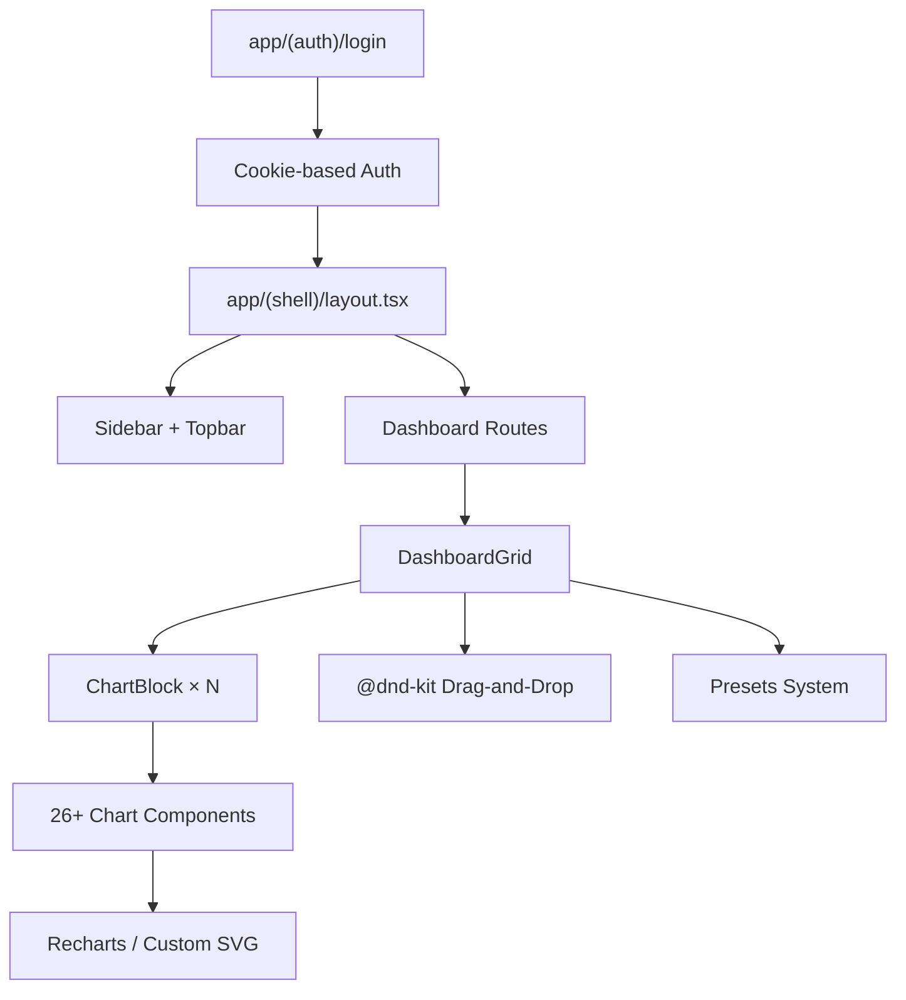

# Beacon Dashboard — Codebase Walkthrough

## Project Summary

**Beacon Dashboard** is a Next.js 16 / React 19 civic monitoring web app for Calbayog City. It provides multi-dashboard views for weather, fire, flood, crime, medical, and infrastructure data with a drag-and-drop grid, 8 OKLCH themes, and 26+ chart types.

---

## Architecture



### Key Layers

| Layer | Files | Purpose |
|-------|-------|---------|
| Auth | [login/page.tsx](file:///Users/gabz/dev/gzw/v0-beacon-dashboard-build/app/(auth)/login/page.tsx), [auth.ts](file:///Users/gabz/dev/gzw/v0-beacon-dashboard-build/lib/auth.ts) | Cookie-based login, `checkAuth()` guard |
| Shell | [sidebar.tsx](file:///Users/gabz/dev/gzw/v0-beacon-dashboard-build/components/shell/sidebar.tsx), [topbar.tsx](file:///Users/gabz/dev/gzw/v0-beacon-dashboard-build/components/shell/topbar.tsx) | Responsive sidebar (Sheet on mobile), live clock |
| Grid | [dashboard-grid.tsx](file:///Users/gabz/dev/gzw/v0-beacon-dashboard-build/components/dashboard/dashboard-grid.tsx) | CSS Grid + @dnd-kit reordering, preset-driven |
| Charts | [components/charts/*](file:///Users/gabz/dev/gzw/v0-beacon-dashboard-build/components/charts) | 26+ components (Recharts + custom SVG) |
| Theme | [theme.ts](file:///Users/gabz/dev/gzw/v0-beacon-dashboard-build/lib/theme.ts), [globals.css](file:///Users/gabz/dev/gzw/v0-beacon-dashboard-build/app/globals.css) | 8 themes × 3 modes = 24 CSS variants |
| Data | [hooks.ts](file:///Users/gabz/dev/gzw/v0-beacon-dashboard-build/lib/hooks.ts), [types.ts](file:///Users/gabz/dev/gzw/v0-beacon-dashboard-build/lib/types.ts) | Mock data hooks (hardcoded, pre-OC migration) |
| Presets | [presets.ts](file:///Users/gabz/dev/gzw/v0-beacon-dashboard-build/lib/presets.ts) | 9 dashboard presets (overview → fire) |

---

## Dashboard Routes

| Route | Preset | Focus |
|-------|--------|-------|
| `/dashboard/overview` | `overview` | City risk, trends, heatmaps |
| `/dashboard/weather` | `weather` | Temperature, precipitation, forecasts |
| `/dashboard/station` | `weather_station` | NwSSU-AWS sensor data (13 charts) |
| `/dashboard/fire` | `fire` | Fire incidents, response times |
| `/dashboard/flood` | `flood` | Flood warnings, levels |
| `/dashboard/crime` | `crime` | Crime stats, patterns |
| `/dashboard/medical` | `medical` | Medical incidents |
| `/dashboard/infrastructure` | `infrastructure` | Road, utilities |
| `/dashboard/table` | — | TanStack Table (planned) |

---

## Theme System

8 themes, each with dark/soft/light modes (24 total CSS `[data-theme]` selectors):

| Theme | Accent |
|-------|--------|
| CivicPulse | Blue |
| Obsidian Ops | Orange |
| Calbayog Gov+ | Forest green |
| NwSSU Academic | Deep maroon |
| Civic Fusion | Purple |
| Terracotta Republic | Terracotta |
| Teal Command | Teal |
| Midnight Mono | Monochrome |

> [!NOTE]
> All colors use OKLCH color space for perceptual uniformity. Mode can be `auto` (follows OS), `dark`, `soft`, or `light`.

---

## Chart Components (26+)

Categories:
- **Recharts-based**: LineChart, BarChart, AreaChart, ScatterChart, ComposedChart, BulletChart, SparkBar, RadarChart, TempHumidityBar, MultiTempBar, RainBar
- **Custom SVG**: GaugeArc, WindRose, Compass, SunriseSunset, MoonPhase, TimelineHeatmap, CalendarHeatmap
- **Card-based**: StatCard, LocalForecast, RadialChart

---

## docs/plans — Existing Plans & Roadmap

### Completed Plans

| Plan | Status | Summary |
|------|--------|---------|
| [01-theme-system-status.md](file:///Users/gabz/dev/gzw/v0-beacon-dashboard-build/docs/plans/01-theme-system-status.md) | ✅ Done | 8 themes × 3 modes + settings UI |
| [02-weather-station-charts.md](file:///Users/gabz/dev/gzw/v0-beacon-dashboard-build/docs/plans/02-weather-station-charts.md) | ✅ Implemented | 13 chart types wired to weather_station preset |

### Pending Plans

| Plan | Status | Summary |
|------|--------|---------|
| [03-future-enhancements.md](file:///Users/gabz/dev/gzw/v0-beacon-dashboard-build/docs/plans/03-future-enhancements.md) | 📋 Backlog | Real-time data, MFA, notifications, reporting |
| [04-gauge-chart-layout-fixes.md](file:///Users/gabz/dev/gzw/v0-beacon-dashboard-build/docs/plans/04-gauge-chart-layout-fixes.md) | ⏳ Pending | Fix SVG viewBox clipping, needle overlap |
| [05-layout-responsiveness-fixes.md](file:///Users/gabz/dev/gzw/v0-beacon-dashboard-build/docs/plans/05-layout-responsiveness-fixes.md) | ⏳ Pending | Topbar timer repositioning, sidebar scroll |
| [05-responsive-charts-grid-refactor.md](file:///Users/gabz/dev/gzw/v0-beacon-dashboard-build/docs/plans/05-responsive-charts-grid-refactor.md) | ⏳ Pending | 3-phase mobile grid + chart responsiveness |

### OC (opencode) Series — Sequential Roadmap

The `docs/plans/OC/` folder contains 5 detailed implementation prompts designed for sequential execution:

| # | Plan | Dependencies | Goal |
|---|------|-------------|------|
| 1 | [BEACON_OC_1_MOCK_DATA.md](file:///Users/gabz/dev/gzw/v0-beacon-dashboard-build/docs/plans/OC/BEACON_OC_1_MOCK_DATA.md) | None | `lib/mock-data/` module with seeded PRNG generators for all data |
| 2 | [BEACON_OC_2_WIRING.md](file:///Users/gabz/dev/gzw/v0-beacon-dashboard-build/docs/plans/OC/BEACON_OC_2_WIRING.md) | OC-1 | Replace hardcoded data → hook layer + chart color theming |
| 3 | [BEACON_OC_3_TABLE.md](file:///Users/gabz/dev/gzw/v0-beacon-dashboard-build/docs/plans/OC/BEACON_OC_3_TABLE.md) | OC-1, OC-2 | Wire TanStack Table with sort/filter/search/pagination |
| 4 | [BEACON_OC_4_MAP.md](file:///Users/gabz/dev/gzw/v0-beacon-dashboard-build/docs/plans/OC/BEACON_OC_4_MAP.md) | OC-1 | MapLibre GL JS + GeoJSON layers + clustering + URL params |
| 5 | [BEACON_OC_5_WEATHER_LIVE.md](file:///Users/gabz/dev/gzw/v0-beacon-dashboard-build/docs/plans/OC/BEACON_OC_5_WEATHER_LIVE.md) | OC-1, OC-2 | Live WeatherLink API via Effect v4 + Hono (optional) |

---

## Current State & Key Observations

> [!IMPORTANT]
> The app currently uses **hardcoded mock data** in hooks. The OC series plans to migrate this to a proper `lib/mock-data/` module with seeded generators, which is the prerequisite for wiring charts, tables, and maps.

- **Grid**: ✅ Now responsive — `grid-cols-1 sm:grid-cols-2 lg:grid-cols-3` with per-card colSpan clamping via `useWindowWidth` hook

## Mobile Responsiveness Fix (latest)

Two surgical changes made to fix horizontal overflow on mobile:

### 1. `dashboard-grid.tsx` — Responsive grid columns

```diff
- className="grid gap-4"
- style={{ gridTemplateColumns: 'repeat(3, 1fr)', gridAutoRows: 'minmax(220px, auto)' }}
+ className="grid grid-cols-1 sm:grid-cols-2 lg:grid-cols-3 gap-4"
+ style={{ gridAutoRows: 'minmax(220px, auto)' }}
```

### 2. `chart-block.tsx` — Clamp colSpan per breakpoint

Added a `useWindowWidth()` hook that returns live window width, then computes `effectiveColSpan`:
- `< 640px` → 1 (mobile)
- `< 1024px` → `min(colSpan, 2)` (tablet)  
- `≥ 1024px` → stored `colSpan` (desktop)

### Screenshots

````carousel

<!-- slide -->

<!-- slide -->

````
- **Charts**: All implemented and rendering, but some SVG charts (gauge, compass, heatmaps) have known sizing issues
- **Data**: All hooks return static inline values — no API integration yet
- **Table page**: Shell exists but TanStack Table not yet wired (OC-3)
- **Map page**: Shell exists but MapLibre not yet integrated (OC-4)
- **Auth**: Simple cookie-based — MFA planned in future enhancements
